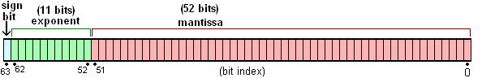
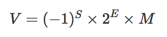

<!--
 * @Author: tangdaoyong
 * @Date: 2021-04-20 14:15:20
 * @LastEditors: tangdaoyong
 * @LastEditTime: 2021-04-20 14:59:41
 * @Description: Number精度
-->
# Number精度

## 参考

[JS Number精度](https://blog.csdn.net/weixin_39786850/article/details/110746250)

## 介绍

`Number`遵循 `[IEEE 754](https://en.wikipedia.org/wiki/IEEE_floating_point)` 规范：

* 先把Number转成二进制科学计数法表示；
* 然后用64位bit存储二进制科学计算法的相关参数。

64位bit分为三个部分:

* 符号位S：第 1 位是正负数符号位（sign），0代表正数，1代表负数
* 指数位E：中间的 11 位存储指数（exponent），用来表示次方数
* 尾数位M：最后的 52 位是尾数（mantissa），超出的部分自动进一舍


比如：十进制数字`4.5`转成二进制就是 `100.1`，二进制的科学计数法表示就是`1.001*2^2`。
此时`M = 1001`，但是因为二进制科学计数法的尾数`M`的第一位固定的`1`，所以可以直接省去（这样可以节省一个bit，导致`M`最多可以表示`53`位），即最终`M = 001`。

1. 为什么`Number`的最大整数是`2 ^ 53 -1`呢?
整数需要连续性，所以表示整数时不能使用指数位E区域，只有尾数`M`区域可表示连续的数据，上面说了其实`M`最多可以表示`53`位。所以最大的安全整数是`2 ^ 53 -1`。大于 `9007199254740992` 的可能会丢失精度。`Number.MAX_SAFE_INTEGER`为`9007199254740991`。
2. `Array`索引既然是整数,那它的最大索引为什么不是`2 ^ 53 - 1`呢
`JS`语言中数组的索引最大就是`2^32 -1`。就当做语言规范吧，背后的原因不清楚。除了数组索引，还有其他的地方采用`32bit`整数：

* 位运算
* `setTimeout/setInterval`的`delay`参数也是必须是`32`整数

数组的最大长度是2的32次方减1，这个不是指数组只能存2^32-1位数据，也不是说数组的下标最大值就是2^32-1，而是指数组的`length`属性最大值为`2^32-1`。

`ECMAScript` 标准约定`number`数字需要被当成 `64` 位双精度浮点数处理，但事实上，一直使用 `64` 位去存储任何数字实际是非常低效的，所以 `JavaScript` 引擎并不总会使用 `64` 位去存储数字，引擎会在内部采用其他内存表示方式，如 `32` 位。

## 思考

`JS`和`toFixed`也能看到实际的值。`toFixed()` 方法可把 `Number` 四舍五入为指定小数位数的数字。
```js
Number.MAX_SAFE_INTEGER.toFixed(64)
"9007199254740991.0000000000000000000000000000000000000000000000000000000000000000"
Number.MAX_SAFE_INTEGER
9007199254740991
(0.1).toFixed(64)
"0.1000000000000000055511151231257827021181583404541015625000000000"
(0.2).toFixed(64)
"0.2000000000000000111022302462515654042363166809082031250000000000"
(0.1 + 0.2).toFixed(64)
"0.3000000000000000444089209850062616169452667236328125000000000000"
0.1 + 0.2 == 0.3
false
```
`0.1 + 0.2 不等于 0.3`原因很简单，因为0.1存储的值比实际值大了一点，0.2也是大了一点（差值比0.1大一倍），两个相加就大很多了，多出来的就是那个尾巴。为什么0.1不能够被准确存储呢？因为计算机都是二进制的，在十进制能表示的数不一定能被二进制精确表示，就好像在十进制里面无法准确表示1/3一样，而在三进制里面0.1便表示1/3了。在二进制里面能够被精确表示都必须得是二的倍数的组合，如二进制的`0.1`表示十进制的`0.5`，`0.11`便表示`0.75（ = 0.5 + 0.25）`，`0.111`表示`0.875（ = 0.5 + 0.25 + 0.125）`，假设现在要存储0.625那么能够被精确表示为二进制的0.101，如果要表示`0.626`呢？那么应该是通过后面的小数位相加拼凑，让其尽可能逼近`0.626`. 这个时候就不是精确表示了，这个事情就是编译器的工作。


下面等式成立
```js
Number.MAX_SAFE_INTEGER + 1 === Number.MAX_SAFE_INTEGER + 2
```
超出了最大安全范围
```js
(Number.MAX_SAFE_INTEGER + 1).toFixed(64)
"9007199254740992.0000000000000000000000000000000000000000000000000000000000000000"
(Number.MAX_SAFE_INTEGER + 2).toFixed(64)
"9007199254740992.0000000000000000000000000000000000000000000000000000000000000000"
(Number.MAX_SAFE_INTEGER + 3).toFixed(64)
"9007199254740994.0000000000000000000000000000000000000000000000000000000000000000"
(Number.MAX_SAFE_INTEGER + 4).toFixed(64)
"9007199254740996.0000000000000000000000000000000000000000000000000000000000000000"
(Number.MAX_SAFE_INTEGER + 5).toFixed(64)
"9007199254740996.0000000000000000000000000000000000000000000000000000000000000000"
(Number.MAX_SAFE_INTEGER + 6).toFixed(64)
"9007199254740996.0000000000000000000000000000000000000000000000000000000000000000"
(Number.MAX_SAFE_INTEGER + 7).toFixed(64)
"9007199254740998.0000000000000000000000000000000000000000000000000000000000000000"
```