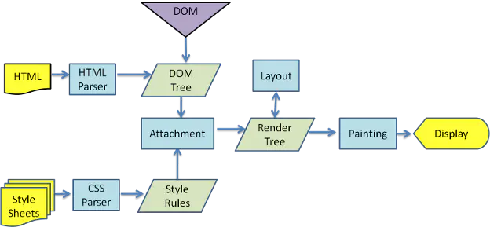

<!--
 * @Author: tangdaoyong
 * @Date: 2021-03-15 09:23:50
 * @LastEditors: tangdaoyong
 * @LastEditTime: 2021-03-15 09:41:29
 * @Description: V8引擎
-->
# V8引擎

前言
在过去的几年里，JavaScript高速发展成为了互联网中最热门的高级语言之一，它在性能上的提升以及不断涌现的前沿web技术使其成为HTML5的中坚力量。由于V8引擎在JavaScript性能优化方面做了很大的提升，所以也让他成为了大众喜爱的开源高性能JavaScript引擎，目前被用于谷歌浏览器，安卓浏览器，node.js等大型项目中，并成为了不可或缺的一部分。

网页渲染流程
用户输入url
webkit调用资源加载器加载相应资源
HTML解析器生成DOM树
JavaScript代码由JavaScript引擎处理
CSS解析出Style Rules（生成CSSOM）
DOM树建立后根据CSS样式进行构建内部绘图模型，生成RenderObject树
根据网页层次结构构建RenderLayer树，同时构建虚拟绘图上下文
依赖2D和3D图形库渲染成图像结果呈现在浏览器中（Painting）

JavaScript vs C++
c++是编译型语言，在程序执行之前必须进行专门的编译过程，在生成本地代码的过程中，变量的地址和类型已经确定，运行本地代码时利用数组和位移就可以存取变量和方法的地址，不需要再进行额外的查找，几个机器指令即可完成，节省了确定类型和地址的时间，执行效率高

JavaScript是解释行语言，支持动态类型，弱类型，在程序运行的时候才进行编译，而编译前需要确定变量的类型，效率比较低，对不同系统平台有较大的兼容性（跨平台性好），需要快速地执行和解析JavaScript脚本来提高性能，V8因此而诞生

V8引擎诞生
v8是谷歌开源的一个基于C++语言开发的JavaScript引擎，可以实现ECMA-262中规定的ECMAScript，其被用于谷歌浏览器chrome，安卓浏览器，node.js等大型项目当中，V8引擎可以独立运行不依赖于其他环境，也可以嵌入任何的C++应用当中使用。

V8工作流程
V8将JavaScript代码进行编译，生成抽象语法树（AST），对作用域进行分析，分辨出局部变量或全局变量，再通过JIT技术将语法树直接转换成原生代码，没有经过字节码的编译，节省了编译时间，得到了不是最优的代码，其后通过数据分析器挑选使用频率高的代码进行优化，若优化后的效果不如之前的话就进行优化回滚

V8 vs JavaScriptCore
JavaScriptCore是WebKit中默认的JavaScript引擎，它是苹果开源的一个项目，是苹果Safari浏览器的JavaScript引擎，应用较为广泛。

JavaScriptCore的大致流程：JavaScript源代码 -> 抽象语法树（AST）-> 字节码-> 本地代码

V8的大致流程：JavaScript源代码 -> 抽象语法树（AST）-> 本地代码 （2017年4月发布5.9版本后新增了Ignition字节码解释器，与JScore流程大致相同）

V8特性
两种编译器：full compiler 和 crankshaft（后来在5.9版本后被消除）

full compiler： full compiler是不含优化的编译器，目标是快速地生成原生代码，以保持页面始终快速运转，所以full compiler省去了将语法树（AST）转换为字节码的过程，直接生成原生代码。

crankshaft： 由于full compiler没有对代码进行优化，所以V8引入了crankshaft编译器，通过数据分析器来挑选使用频率高的函数来进行优化，生成高效的原生代码，但是鉴于JavaScript是一门动态类型语言，很有可能在程序运行过程中进行类型改变，所以V8会将crankshaft编译过的代码进行优化回滚，直至回滚到当前最优状态。

内联缓存（Inline caches， ICs）

由于JavaScript是一门动态类型语言，在很多操作上会相当复杂，可能一个简单的操作符都会引发起上百条指令。而V8中使用了内联缓存的机制，大致就是一个包含了对某个操作的多种实现方案的函数，在程序运行的时候动态生成并且缓存起来，方便重用，当再次访问的时候进行判断是否可以直接使用缓存结果，这样减少了很大的工作量。

隐藏类

JavaScript访问对象属性的时候是通过匹配字符串的形式来查找的，而V8借鉴了C++语言中类和偏移位置的思想，实现了隐藏类，将对象按照属性是否相同划分到不同的组当中，将这些组的属性名和对应的偏移位置保存在一个隐藏类中，组内所有对象共享该信息。假如对象中新增了新的属性，那么这个对象就会被划分到一个新的隐藏类当中。

垃圾回收

JavaScript使用了垃圾回收的机制，也意味着程序中是不能对内存进行管理的，这样的好处是无需程序员来额外操作内存问题，防止内存泄漏，但是坏处是无法对内存进行控制也无法对垃圾回收器进行反馈。

垃圾回收器意味着识别到需要回收的内存，将其重新分配或返还给操作系统。先看看V8的内存管理，V8将数据分为新生代，老生代和大对象区。

新生代：为新创建的对象分配内存空间，经常需要进行垃圾回收。为方便年轻分代中的内容回收，可再将年轻分代分为两半，一半用来分配，另一半在回收时负责将之前还需要保留的对象复制过来。我们只需保有一个指向内存区的指针，不断根据新对象的大小对其进行递增即可。当该指针达到了新生代区的末尾，就会有一次清理，清理掉新生代区中不活跃的死对象。
老生代：字符串、封箱的数字以及未封箱的双精度数字数组，在新生区存活一段时间后会被移动到这里。根据需要将年老的对象、指针、代码等数据保存起来，较少地进行垃圾回收。
大对象区：为那些需要使用较多内存对象分配内存，当然同样可能包含数据和代码等分配的内存，一个页面只分配一个对象。垃圾回收器从不移动大对象。
在新生代中垃圾回收主要采用Scavenge算法，新生代区被划分为两个等大的子区：出区、入区。绝大多数内存的分配都会在出区发生，当出区耗尽时，我们交换出区和入区（这样所有的对象都归属在入区当中），然后将入区中活跃的对象复制至出区或老生代区当中。
在老生区中，V8在标记－清除或标记－紧缩（大周期）的过程中进行回收。大周期进行的并不频繁。一次大周期通常是在移动足够多的对象至老生区后才会发生。至于足够多到底是多少，则根据老生区自身的大小和程序的动向来定。

V8后续发展
在2017年4月V8发布的5.9 版本中，V8团队收集了JavaScript的实测性能并仔细分析了Full-codegen的缺点和Crankshaft,新增了一个 Ignition字节码解释器，TurboFan和Ignition结合起来共同完成JavaScript的编译。关于更多TurboFan and Ignition的资料，可以参考：https://cnodejs.org/topic/59084a9cbbaf2f3f569be482和http://benediktmeurer.de/2016/11/25/v8-behind-the-scenes-november-edition/

认识 V8 引擎(https://zhuanlan.zhihu.com/p/27628685)
A tour of V8 系列之垃圾回收(http://jayconrod.com/posts/55/a-tour-of-v8-garbage-collection)
A tour of V8 系列之对象的表示(https://www.jayconrod.com/posts/52/a-tour-of-v8-object-representation)
A tour of V8 系列之编译器(https://www.jayconrod.com/posts/51/a-tour-of-v8-full-compiler)