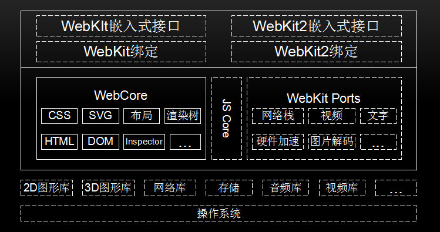

<!--
 * @Author: tangdaoyong
 * @Date: 2021-03-15 10:02:52
 * @LastEditors: matiastang
 * @LastEditTime: 2022-07-21 17:41:34
 * @Description: WebKit
-->
# WebKit

[Webkit 内核初探](https://zhuanlan.zhihu.com/p/181199232)
[认识 V8 引擎](https://zhuanlan.zhihu.com/p/27628685)
[Webkit 内核初探](https://zhuanlan.zhihu.com/p/181199232)
[浏览器内核原理--chromium blink基础](https://zhuanlan.zhihu.com/p/48074353)
[WKWebView问题优化指南](https://zhuanlan.zhihu.com/p/58681116)

渲染引擎：能够将HTML/CSS/JavaScript文本及相应的资源文件转换成图像结果。渲染引擎的主要作用是将资源文件转化为用户可见的结果。在浏览器的发展过程中，不同的厂商开发了不同的渲染引擎，如Tridend(IE)、Gecko(FF)、WebKit(Safari,Chrome,Andriod浏览器)等。WebKit是由苹果2005年发起的一个开源项目，引起了众多公司的重视，几年间被很多公司所采用，在移动端更占据了垄断地位。更有甚者，开发出了基于WebKit的支持HTML5的web操作系统(如：Chrome OS、Web OS)。

下面是WebKit的大致结构：

上图中实线框内模块是所有移植的共有部分，虚线框内不同的厂商可以自己实现。下面进行介绍：

操作系统：是管理和控制计算机硬件与软件资源的计算机程序，是直接运行在“裸机”上的最基本的系统软件，任何其他软件都必须在操作系统的支持下才能运行。WebKit也是在操作系统上工作的。
第三方库，为了WebKit提供支持，如图形库、网络库、视频库等。
WebCore 是各个浏览器使用的共享部分，包括HTML解析器、CSS解析器、DOM和SVG等。JavaScriptCore是WebKit的默认引擎，在谷歌系列产品中被替换为V8引擎。WebKit Ports是WebKit中的非共享部分，由于平台差异、第三方库和需求的不同等原因，不同的移植导致了WebKit不同版本行为不一致，它是不同浏览器性能和功能差异的关键部分。
WebKit嵌入式编程接口，供浏览器调用，与移植密切相关，不同的移植有不同的接口规范。
测试用例，包括布局测试用例和性能测试用例，用来验证渲染结果的正确性。

[miniblink](https://zhuanlan.zhihu.com/p/22611497)

为什么要做miniblink？市面上作为嵌入的组件的可用的浏览器内核，不外乎这几个：webkit、cef、nwjs、electron。cef：优点是由于集成的chromium内核，所以对H5支持的很全，同时因为使用的人也多，各种教程、示例，资源很多。但缺点很明显，太大了。最新的cef已经夸张到了100多M，还要带一堆的文件。同时新的cef已经不支持xp了（chromium对应版本是M49）。而且由于是多进程架构，对资源的消耗也很夸张。如果只是想做个小软件，一坨文件需要带上、超大的安装包，显然不能忍受。nwjs，或者最近大火的electron：和cef内核类似，都是chromium内核。缺点和cef一模一样。优点是由于可以使用nodejs的资源，同时又自带了各种api的绑定，所以可以用的周边资源非常丰富；而基于js的开发方案，使得前端很容易上手。所以最近N多项目都是基于nwjs或electron来实现。例如vscode，atom等等。原版webkit：现在官网还在更新windows port，但显然漫不在心，而且最新的webkit也很大了，超过20几M。最关键的是，周边资源很少，几乎没人再基于webkit来做开发。同时由于windows版的saferi已经停止开发了，所以用webkit就用不了他的dev tools了。这是个大遗憾。WKE：这是个很老的webkit内核的裁剪版了。小是小，但bug太多了。那么关键点来了，使用miniblink有啥好处呢？？首先，miniblink对大小要求非常严格。原版chromium、blink里对排版渲染没啥大用的如音视频全都被砍了，只专注于网页的排版和渲染。甚至为了裁剪大小，我不惜使用vc6的crt来跑mininblink(见我上篇文章)。这个也算前无古人后无来者了。其次，miniblink紧跟最新chromium，这意味着chromium相关的资源都可以利用。在未来的规划里，我是打算把electron的接口也加上的，这样可以无缝替换electron。使用miniblink的话，开发调试时用原版electron，发布的时候再替换掉那些dll，直接可以无缝切换，非常方便。

## 介绍

Webkit可以在不同的操作系统上工作。不同浏览器可能会依赖不同的操作系统，同一个浏览器使用的Webkit也可能依赖不同的操作系统，例如，Chromium浏览器支持Windows、Mac OS、Linux、Android等系统。在操作系统层之上就是Webkit赖以工作的众多第三方库，这些库是Webkit运行的基础。如何高效的使用它们是Webkit和各种浏览器厂商的重大课题，主要是如何设计良好的架构来利用它们以获得高性能。
在这些库之上就是Webkit项目了，图中将其分为两层，每层包含很多模块，图中这些模块支撑了网页加载和渲染过程：

1. WebCore部分包含了目前被各个浏览器所使用的Webkit共享部分，这些都是加载和渲染网页必不可少的基础部分，具体包括HTML解释器、CSS解释器、SVG、DOM、渲染树（RenderObject）、RenderLayer树等，以及Inspector（Web Inspector、调试网页）。

2. JavaScriptCore引擎是Webkit中的默认JavaScript引擎。刚开始，它的性能并不是很好，但是随着越来越多的优化被加入，现在性能已经非常不错了。之所以说它是默认的，是因为它并不是不可替换的，事实上，Webkit中对JavaScript引擎的调用是独立于引擎之上的。在Google的Chromium开源项目中，它被替换为V8引擎。

3. Webkit Ports指的是Webkit中的非共享部分，对于不同浏览器使用的Webkit来说，移植中的这些模块由于平台差异、依赖的第三方库和需求不同，往往按照自己的方式来设计和实现，这也是众多Webkit版本行为不一致的重要原因。

4. 在往上则是提供嵌入式编程接口，这些嵌入式接口是提供给浏览器调用的。

5. 当然，由于图片大小有限，还有一个重要的部分没有画出来，那就是测试用例，包括布局测试用例和性能测试用例。

[Webkit底层原理（1）--Webkit架构和模块](https://zhuanlan.zhihu.com/p/85014585)
[Webkit底层原理（2）--资源加载和网络栈](https://zhuanlan.zhihu.com/p/85084455)
[浏览器缓存详细介绍](https://zhuanlan.zhihu.com/p/67436128)
[Webkit底层原理（3）--HTML解释器](https://zhuanlan.zhihu.com/p/85171375)
[Webkit底层原理（4）--DOM事件机制和Shadow DOM](https://zhuanlan.zhihu.com/p/85283473)
[Webkit底层原理（5）--CSS解释器和布局](https://zhuanlan.zhihu.com/p/85340501)
[深入理解 WKWebView（入门篇）—— WebKit 源码调试与分析](https://zhuanlan.zhihu.com/p/436580465)

## 多进程模型

以前使用浏览器打开很多页面的，不幸其中某个页面崩溃了，会导致其他所有的页面也都崩溃。但是，现在好了，浏览器都支持多进程模型，虽然会带来更多的资源消耗，但是它的优势非常明显：

1. 避免因单个页面的崩溃而影响整个浏览器的稳定；
2. 当第三方插件崩溃时也不会影响浏览器的整体稳定；
3. 更加方便安全模型的实施。

其中包含一下进程类型：

* Browser进程：浏览器的主进程，负责浏览器界面的显示、各个页面的管理，有且仅有一个。
* Renderer进程：网页的渲染进程，负责页面的渲染工作，Blink/Webkit的渲染工作主要在该进程中完成，可能有多个，注意：Renderer进程的数量和用户打开的页面数量不一定相等。Chromium设计了灵活的机制，允许用户配置。
* NPAPI插件进程：该进程是为NPAPI类型的插件而创建的。其创建的基本原则是每种类型的插件只会被创建一次，而且仅当使用的时候才创建。插件进程是被共享的。
* GPU进程：最多一个，当且仅当GPU硬件加速打开的时候才会被创建，主要用于3D图形加速调用的实现。
* Pepper插件进程：同NPAPI插件进程。

## 多线程模型

每个进程内部都有很多的线程，多线程的目的是为了保持用户界面的高响应度，保证UI线程不会被其他费时的操作阻塞从而影响用户体验。类似的费时操作有很多，比如本地文件读写，数据库操作等。而在Renderer进程中，Chromium则不让其他操作阻塞渲染进程的快速进行。更甚者，为了利用多核的优势，将渲染过程管线化，这样可以让渲染的不同阶段在不同的线程中执行。下图是主要进程中的重要线程信息以及它们是如何工作的。

网页的加载和渲染过程如下：

Browser进程收到用户的请求，首先由UI线程处理，而且将相应的任务转给IO线程，它随即将该任务交给Renderer进程；
Renderer进程的IO线程经过简单的解释后交给渲染线程。渲染线程接受请求，加载网页并渲染网页，这其中可能需要Browser进程获取资源和需要GPU进程来帮助渲染。最后Renderer进程将结果由IO线程传递给Browser进程；
最后，Browser接收到结果并将结果绘制出来。

* v8的两个主要组成部分：内存堆（数据存储的地方） 调用栈（代码执行的地方）。
* 有一些浏览器的api不是由js引擎提供的，如dom,定时器，ajax等，我们称之为web api。
* js是一种单线程编程语言，只有一个调用堆栈。调用栈是一种数据结构，记录了我们在程序中的位置。运行一个函数时，它会将其放到栈顶，当从这个函数返回的时* 候，就会将这个函数从栈顶弹出。
* 每一个进入调用栈的都称为调用帧，方便堆栈追踪。
* 堆栈溢出：调用堆栈中的函数调用数量超过了调用堆栈的实际大小，浏览器会抛出一个堆栈溢出错误
* 并发与事件循环产生原因：当调用堆栈有函数要执行时，浏览器实际上不能做任何其他事情——它被阻塞了，如果函数执行所需时间过程就会造成卡顿，甚至报一个错误，询问你是否想终止 web 页面。