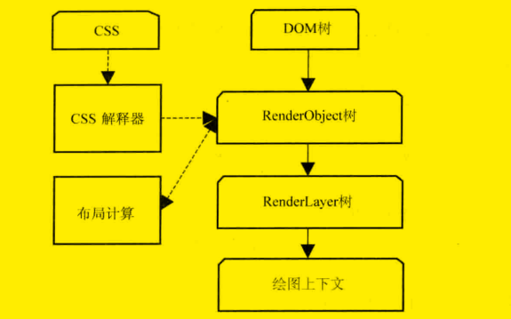
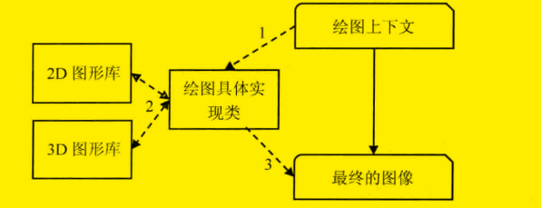
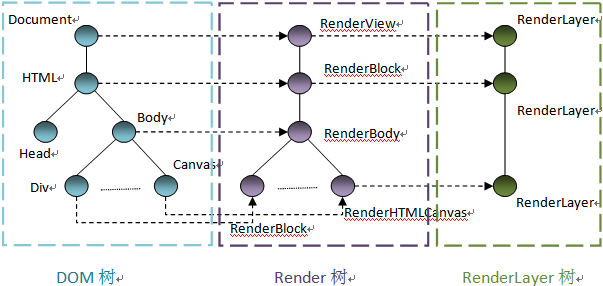
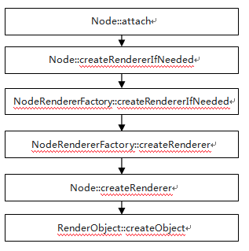
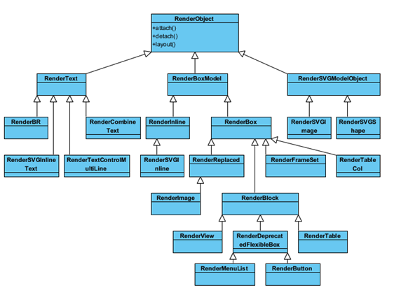

<!--
 * @Author: tangdaoyong
 * @Date: 2021-04-27 10:54:12
 * @LastEditors: tangdaoyong
 * @LastEditTime: 2021-04-27 14:29:35
 * @Description: 渲染流程
-->
# 渲染流程

[webkit 渲染机制](https://www.cnblogs.com/tianheila/p/6413586.html)

最近看了< webkit技术内幕 >，虽然并不能完全看懂，但是对浏览器的渲染机制也算是有了一个比较完整的认识。

我们从浏览器地址栏输入网址开始到web页面被完整的呈现在眼前，大概的经过了这样一个过程：网址被DNS解析为IP地址 -> 通过IP地址建立TCP连接 -> 发送HTTP请求 -> 服务器处理请求并返回响应 ->  浏览器解析渲染页面 -> 断开TCP连接

可是浏览器是怎么去解析渲染页面的呢？这里就要涉及到浏览器的内核，也就是浏览器的渲染引擎（严格来说应该是渲染引擎 + Javascript引擎），页面的渲染工作便是由渲染引擎完成的。需要注意浏览器和浏览器内核是不同的概念，浏览器指的是 Chrome、Firefox 等，而浏览器内核则是 Blink、Gecko 等，浏览器内核只负责渲染，GUI 及网络连接等跨平台工作则是浏览器实现的。主流的渲染引擎包括Trident、Gecko、Webkit，它们分别是IE、火狐和Chrome的内核（2013年，Google宣布了Blink内核，它其实是从Webkit复制出去的）。一般渲染引擎主要包括HTML解释器、CSS解释器、Javascript引擎、布局、绘图等模块。当然这些模块还依赖很多其他的基础模块。

我们先简单的了解一下渲染引擎各个主模块所做的工作（以下所有的介绍以 webkit 为介绍对象）

## HTML解释器

HTML解释器的工作就是将网络或者本地磁盘获取到的HTML网页和资源从字节流解释成DOM树的结构（首先是字节流，经过解码之后是字符流，然后通过词法分析器会被解释成词语（TOKENS），经过语法分析器构建成节点，最后这些节点被组建成一颗DOM树）

## CSS解释器

CSS字符串被CSS解释器处理后变成渲染引擎的内部规则表示。（样式规则建立完成之后，webkit会保存规则结果，当DOM的节点建立之后，webkit会为可视化节点选择合适的样式信息，即作样式规则匹配）

## Javascript引擎

将Javascript代码处理并执行，一个Javascript引擎可以包括以下几个部分 ->

　　编译器 -> 主要工作是将源代码编译成抽象语法树，在某些引擎中还包括将抽象语法树转换为字节码（JavascriptCore 引擎）。

　　解释器  -> 在某些引擎中，解释器主要是接收字节码，解释执行字节码，同时也依赖垃圾回收机制等。

　　JIT工具 -> 将字节码或者抽象语法树转换为本地代码 （V8 引擎）

　　垃圾回收器和分析工具

## 布局 ：计算RenderObject对象的位置、大小等信息

## 绘图 ：将构建好的渲染内部表示模型使用图形库绘制出来

页面的最终渲染便是上述模块综合处理的结果。根据数据的流向，这里可以把渲染的过程分为三个阶段，第一个阶段是从网页的url到构建完dom树，第二个阶段是从dom树到构建完webkit的绘图上下文，第三个阶段是从绘图上下文到生成最后的图像。

上图描述的是网页 url 到构建完DOM树的整个过程，数字表示的是基本顺序，不过也不是严格一致，因为这个过程可能会有所重复或者交叉。

具体的过程如下：

1 当用户输入网页url的时候，webkit调用资源加载器加载对应的网页。

2 加载器依赖网络模块建立连接，发生请求并接收响应。

3 webkit接收到各种网页或者资源的数据，其中某些资源可能是同步或者异步的方式获取的。

4 网页被交给HTML解释器解释成一系列词语（Token）

5 解释器根据词语构建节点（Node），形成DOM树。

6 如果节点是Javascript代码的话，调用Javascript引擎解释执行。

7 Javascript代码可能会修改DOM树的结构。

8 **如果有节点需要依赖其他的资源，比如图片、css、视频等，调用资源加载器来加载它们，不过这个过程是异步的，不会阻碍当前DOM树的继续构建。如果是Javascript资源 url （没有标记异步方式），则需要停止当前DOM树的构建，直到Javascript的资源被加载并被Javascript引擎解释执行后才继续DOM树的创建。**xua

在上述过程当中，网页在加载和被渲染完毕的这一段过程会相继发出“DOMContent”事件和“onload”事件，分别表示DOM树构建完毕以及DOM树及其所有依赖的资源都加载完毕。一般来说“DOMContent”事件会先于“onload”事件发生。

接下来就是Webkit借助 css 和 dom 树构建RenderObject树直到绘图上下文。

1 css文件被css解释器解释为内部表示结果

2 css解释器完成工作之后在dom树上附加解释后的样式信息，这就是RenderObject树

3 RenderObject节点被创建的同时，webkit会根据网页的层次结构创建RenderLayer树，同时创建一个虚拟的绘图上下文。

RenderObject树的建立并不会导致DOM树被销毁，上述四个内部表示结构直到网页被销毁都一直存在。

最后就是根据绘图上下文来生成最终图像了，这一过程主要依赖2D和3D图形库。

生成过程的简单描述如下图所示：

整个渲染的流程至此便是结束了，从渲染的整个过程中我们也可以发现，原来 CSS、图片、视频等资源的加载是异步的，同 dom 树的构建是并发的，而 Javascript 资源的加载和执行却是同步的，这个过程会阻塞 dom 树的构建，同时当然也会阻碍后续资源（比如图片资源）的下载，因为这时候webkit对需要什么资源一无所知，这导致了资源不能并发下载这一严重的性能问题。（其实对于这样的情况，webkit采取了资源预扫描和预加载的机制来实现资源的并发下载而不被 Javascript 的执行所阻碍，但仍要避免这种情况的出现，因为并不是所有的渲染引擎都做了如此的考虑）。所以从这里我们也可以得到一些关于渲染优化方面的启示：

* 最好把脚本文件放在HTML文件的末尾，这样就不会阻塞 dom 树的构建和资源的并发下载

* 如果非要把脚本文件放在HTML文件的前面，请给 script 标签添加 “async” 属性或者 “defer” 属性。前者表明这是一段可以异步执行的 Javascript 代码，而后者表示在加载完 Javascript 之后延迟到 dom 树构建就绪之后再执行代码。如果同时添加 “async” 和 “defer” ，在同时支持这两个属性的浏览器中 “async” 会覆盖掉 “defer”。需要注意的一点是，如果当前添加 “async” 属性的脚本文件依赖有其他的脚本文件，可能会导致添加 “async” 属性的脚本文件先于依赖脚本执行，即使依赖脚本先于添加 “async” 属性的脚本文件被定义。

## RenderObject和RenderLayer

[理解WebKit和Chromium: WebKit渲染基础](https://blog.csdn.net/milado_nju/article/details/7292131)
### RenderObject
Render树是基于DOM树建立起来的一颗新的树， 是布局和渲染等机制的基础设施。 Render树节点和DOM树节点不是一一对应关系，那么哪些情况下需要建立新的Render节点呢？

a)      DOM树的document节点；

b)      DOM树中的可视化节点，例如HTML，BODY，DIV等，非可视化节点不会建立Render树节点，例如HEAD，META，SCRIPT等；

c)      某些情况下需要建立匿名的Render节点，该节点不对应于DOM树中的任何节点；

RenderObject对象在DOM树创建的同时也会被创建，当然，如果DOM中有动态加入元素时，也可能会相应地创建RenderObject对象。下图示例的是RenderObject对象被创建的函数调用过程。

Render树建立之后，布局运算会计算出相关的属性，这其中有位置，大小，是否浮动等。有了这些信息之后，渲染引擎才只知道在何处以及如何画这些元素。

#### RenderObject类及其子类

RenderObject是Render树的节点基础类，提供了一组公共的接口。它有很多的子类，这些子类可能对应一些DOM树中的节点，例如RenderText，有些则是容器类，例如RenderBlock。下图给出了一些常用的类的继承关系图，这其中RenderBlock是一个非常重要的类。

匿名RenderBlock对象

CSS中有块级元素和内嵌(inline)元素之分。内嵌元素表现的是行布局形式，就是说这些元素以行进行显示。以’div’元素为例，如果设置属性’style’为’display:inline’时，则那是内嵌元素，那么它可能与前面的元素在同一行；如果该元素没有设置这个属性时，则是块级元素，那么在新的行里显示。

RenderBlock用来是用来表示块级元素， 为了处理上的方便，某些情况下需要建立匿名的RenderBlock对象，因为RenderBlock的子女必须都是内嵌的元素或者都是非内嵌的元素。所以，当它包含两种元素的时候，那么它会为相邻的内嵌元素创建一个块级RenderBlock节点，然后设置该节点为自己的子女并且设置这些内嵌元素为它的子女。
### RenderLayer

RenderLayer树是基于Render树建立起来的一颗新的树。同样，RenderLayer节点和Render节点不是一一对应关系，而是一对多的关系。那么哪些情况下的RenderObject节点需要建立新的RenderLayer节点呢？

a)      DOM树的document节点对应的RenderView节点

b)      DOM树中的document 的子女节点，也就是HTML节点对应的RenderBlock节点

c)      显式的CSS位置

d)      有透明效果的对象

e)      节点有溢出（overflow），alpha或者反射等效果的

f)       Canvas 2D和3D (WebGL)

g)      Video节点对应的RenderObject对象

 

一个RenderLayer被建立之后，其所在的RenderObject对象的所有后代均包含在该RenderLayer，除非这些后代需要建立自己的RenderLayer。而后代的RenderLayer的父亲就是自己最近的祖先所在的不同的RenderLayer，这样，它们也构成了一颗RenderLayer树。

每个RenderLayer对应的Render节点内容均会绘制在该RenderLayer所对应的层次上（或者内部存储结构上）。不同的RenderLayer可以共享同一个内部存储结构，也可以有各自的后端存储，这取决于不同的移植。在软件渲染下，通常各个RenderLayer的内容都绘制在同一块后端存储上。在GPU硬件加速的下，某些RenderLayer可能有自己独立的后端存储，而后通过合成器来把这些不同的后端合成在一起，最终形成网页的可视化内容。

RenderLayer在创建RenderObject对象的时候，如果需要，也会同时被创建，当然也有可能在执行JavaScript代码时，更新页面的样式从而需要新创建一个RenderLayer。