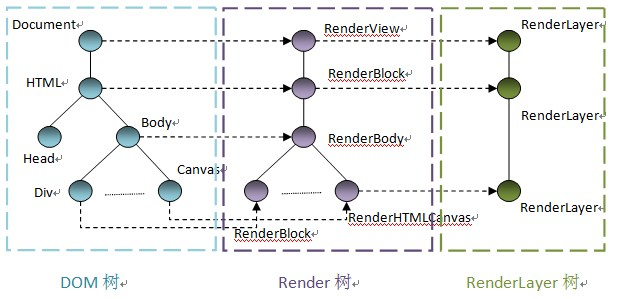

# WebKit渲染基础

[图灵社区](https://www.ituring.com.cn/)
[理解WebKit和Chromium](https://www.ituring.com.cn/book/1210)
[WebKit渲染基础](https://www.ituring.com.cn/book/miniarticle/40625)

## 介绍

`WebKit`是一个渲染引擎，而不是一个浏览器，它专注于网页内容展示，其中渲染是其中核心的部分之一。

那么什么是`DOM`？简单来说，`DOM`是对`HTML`或者`XML`等文档的一种结构化表示方法，通过这种方式，用户可以通过提供标准的接口来访问`HTML`页面中的任何元素的相关属性，并可对`DOM`进行相应的添加、删除和更新操作等。

基于`DOM`树的一些可视`（visual）`的节点，`WebKit`来根据需要来创建相应的`RenderObject`节点，这些节点也构成了一颗树，称之为`Render`树。基于`Render`树，`WebKit`也会根据需要来为它们中的某些节点创建新的`RenderLayer`节点，从而形成一棵`RenderLayer`树。

`Render`树和`RenderLayer`树是`WebKit`支持渲染所提供的基础但是却非常重要的设施。这是因为`WebKit`的布局计算依赖它们，浏览器的渲染和`GPU`硬件加速也都依赖于它们。幸运地是，得益于它们接口定义的灵活性，不同的浏览器可以很方便地来实现自己的渲染和加速机制。

为了直观了解这三种树，下图给出了这三种树及其它们之间的对应关系

## DOM解析流程

浏览器渲染引擎工作流程都差不多，大致分为5步，创建DOM树——创建StyleRules——创建Render树——布局Layout——绘制Painting

    第一步，用HTML分析器，分析HTML元素，构建一颗DOM树(标记化和树构建)。

    第二步，用CSS分析器，分析CSS文件和元素上的inline样式，生成页面的样式表。

    第三步，将DOM树和样式表，关联起来，构建一颗Render树(这一过程又称为Attachment)。每个DOM节点都有attach方法，接受样式信息，返回一个render对象(又名renderer)。这些render对象最终会被构建成一颗Render树。

    第四步，有了Render树，浏览器开始布局，为每个Render树上的节点确定一个在显示屏上出现的精确坐标。

    第五步，Render树和节点显示坐标都有了，就调用每个节点paint方法，把它们绘制出来。 

    DOM树的构建是文档加载完成开始的？构建DOM数是一个渐进过程，为达到更好用户体验，渲染引擎会尽快将内容显示在屏幕上。它不必等到整个HTML文档解析完毕之后才开始构建render数和布局。

    Render树是DOM树和CSSOM树构建完毕才开始构建的吗？这三个过程在实际进行的时候又不是完全独立，而是会有交叉。会造成一边加载，一遍解析，一遍渲染的工作现象。

    CSS的解析是从右往左逆向解析的(从DOM树的下－上解析比上－下解析效率高)，嵌套标签越多，解析越慢。

## DOM 树

## Rander树

## RanderLayer树