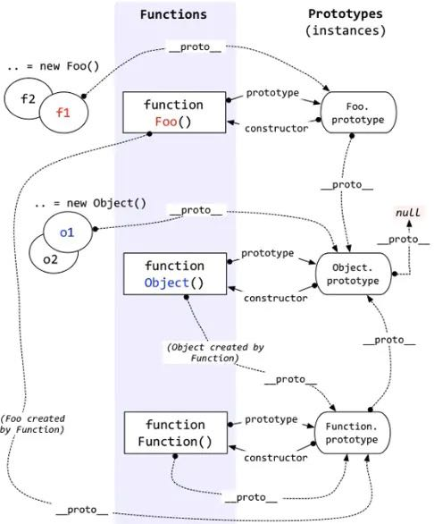

<!--
 * @Author: tangdaoyong
 * @Date: 2021-01-29 09:22:42
 * @LastEditors: tangdaoyong
 * @LastEditTime: 2021-06-15 11:47:06
 * @Description: 原型及原型链
-->
# 原型及原型链

[MDN 原型及原型链](https://developer.mozilla.org/zh-CN/docs/Web/JavaScript/Inheritance_and_the_prototype_chain)



当你执行：
```js
var o = new Foo();
```
`JavaScript` 实际上执行的是：
```js
var o = new Object();
o.__proto__ = Foo.prototype;
Foo.call(o);
```
原生原型不应该被扩展，除非它是为了与新的 `JavaScript` 特性兼容。

## instanceof

`instanceof` 运算符用于检测构造函数的 `prototype` 属性是否出现在`某个实例对象`的原型链上。

语法：`object instanceof constructor`
`object`：某个实例对象
`constructor`：某个构造函数
用来检测  `constructor.prototype` 是否存在于参数  `object` 的原型链上。