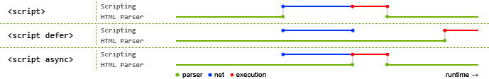

# script标签中defer和async属性

script标签用来在html页面中插入javascript代码，有两种使用方式：

1. 直接在script标签中写js代码
2. 通过script的src属性引用外部js文件

script标签存在两个属性，defer和async，来异步加载js，因此script标签的使用分为三种情况：

1. 

没有defer或async属性，浏览器会立即加载并执行相应的脚本。也就是说在渲染script标签之后的文档之前，不等待后续加载的文档元素，读到就开始加载和执行，此举会阻塞后续文档的加载；

2. 

有了async属性，表示后续文档的加载和渲染与js脚本的加载和执行是并行进行的，即异步执行；

3. 

有了defer属性，加载后续文档的过程和js脚本的加载(此时仅加载不执行)是并行进行的(异步)，js脚本的执行需要等到文档所有元素解析完成之后，DOMContentLoaded事件触发执行之前。

下面网络图片显示了不同使用的区别：

蓝色代表js脚本网络加载时间，红色代表js脚本执行时间，绿色代表html解析。

* 没有 defer 或 async，浏览器会立即加载并执行指定的脚本，也就是说不等待后续载入的文档元素，读到就加载并执行。
* async 属性表示异步执行引入的 JavaScript，与 defer 的区别在于，如果已经加载好，就会开始执行——无论此刻是 HTML 解析阶段还是 DOMContentLoaded 触发之后。需要注意的是，这种方式加载的 JavaScript 依然会阻塞 load 事件。换句话说，async-script 可能在 DOMContentLoaded 触发之前或之后执行，但一定在 load 触发之前执行。
* defer 属性表示延迟执行引入的 JavaScript，即这段 JavaScript 加载时 HTML 并未停止解析，这两个过程是并行的。整个 document 解析完毕且 defer-script 也加载完成之后（这两件事情的顺序无关），会执行所有由 defer-script 加载的 JavaScript 代码，然后触发 DOMContentLoaded 事件。
* async是无顺序的加载，而defer是有顺序的加载。如果存在多个有defer属性的脚本，那么它们是按照加载顺序执行脚本的；而对于async，它的加载和执行是紧紧挨着的，无论声明顺序如何，只要加载完成就立刻执行，它对于应用脚本用处不大，因为它完全不考虑依赖。