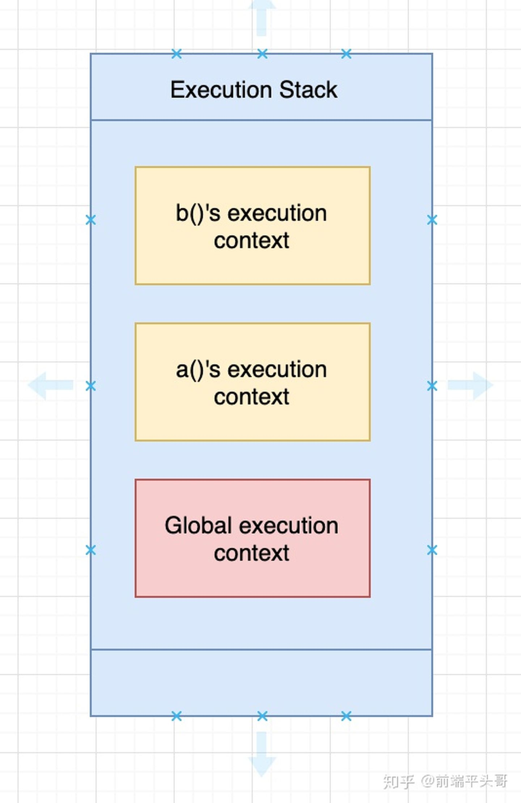
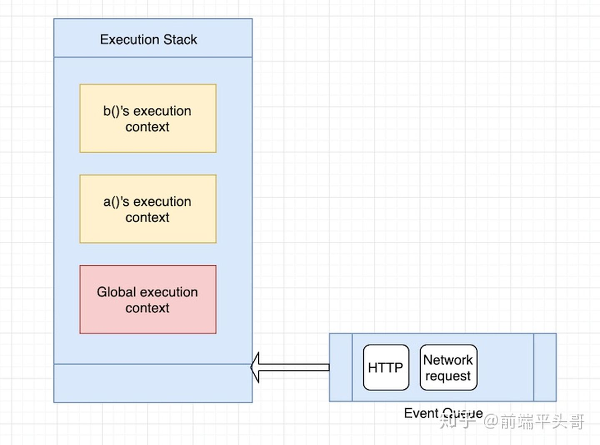

<!--
 * @Author: tangdaoyong
 * @Date: 2021-01-15 10:34:24
 * @LastEditors: tangdaoyong
 * @LastEditTime: 2021-05-28 10:13:35
 * @Description: 执行上下文（Execution context）
-->
# 执行上下文（Execution context）

[执行上下文](https://www.cnblogs.com/gaosirs/p/10569973.html)
[一篇文章看懂JS执行上下文](https://www.cnblogs.com/echolun/p/11438363.html)

当代码运行时，会产生一个对应的执行环境，在这个环境中，所有变量会被事先提出来（变量提升），有的直接赋值，有的为默认值 undefined，代码从上往下开始执行，就叫做执行上下文。

 　　在 JavaScript 的世界里，运行环境有三种，分别是：

　　　　1.全局环境：代码首先进入的环境

　　　　2.函数环境：函数被调用时执行的环境

　　　　3.eval函数：https://www.cnblogs.com/chaoguo1234/p/5384745.html（不常用）

执行上下文特点
　　1.单线程，在主进程上运行

　　2.同步执行，从上往下按顺序执行

　　3.全局上下文只有一个，浏览器关闭时会被弹出栈

　　4.函数的执行上下文没有数目限制

　　5.函数每被调用一次，都会产生一个新的执行上下文环境

执行上下文栈
　　执行全局代码时，会产生一个执行上下文环境，每次调用函数都又会产生执行上下文环境。当函数调用完成时，这个上下文环境以及其中的数据都会被消除，再重新回到全局上下文环境。处于活动状态的执行上下文环境只有一个。

　　其实这是一个压栈出栈的过程——执行上下文栈。

执行上下文生命周期

执行上下文共分3个阶段，分别是：

　　　　1.创建阶段

　　　　　　(1).生成变量对象

　　　　　　(2).建立作用域链

　　　　　　(3).确定 this 指向

 

　　　　2.执行阶段

　　　　　　(1).变量赋值

　　　　　　(2).函数引用

　　　　　　(3).执行其他代码

 

　　　　3.销毁阶段

　　　　　　执行完毕出栈，等待回收被销毁

## JavaScript 执行栈

无论什么时候在 JavaScript 中写一个函数，js 引擎就会相应地创建一个函数执行上下文，另外 JS 引擎开始工作的时候，会创建一个安居的执行上下文保存全局的对象 —— 例如，浏览器中的 window 对象，Nodejs 中的 global 对象。这两种上下文在 JS 中使用一个栈的对象结构也叫作 执行栈 来处理的。

因此，当你写了下面的代码：
```js
function a() {
  console.log("i am a")
  b()
}

function b() {
  console.log("i am b")
}

a()
```
JavaScript 引擎会首先创建一个全局执行上下文，然后将它压入执行栈。然后为函数 a() 创建一个上下问，因为 b() 在 a() 内调用的，它会为 b() 创建另一个函数的执行上下文，然后将它压入栈。

当函数 b() 返回后，引擎会销毁 b() 的上下文，当 退出 a() 的执行后，a() 的上下文环境也会被销毁。在执行器件栈如下图：



但是当浏览器发起如 HTTP 请求的异步事件会发生什么？JS 引擎保留执行上下文栈吗，然后处理异步事件，或者直到事件结束？

JS 引擎在这里的处理方式不太一样。在执行栈顶部，有一个队列的数据结构，也被称为事件队列。事件队列处理进入浏览器的HTTP 或者 网络事件。



JS 引擎处理队列的方式是通过等待执行栈为空的时候。因此一旦执行栈为空了，JS 引擎就会检查事件队列，出队，然后处理那个事件回调。注意，JS 引擎只有在执行栈为空或者在执行栈中只有全局执行上下文的时候才回去检查事件队列。

尽管我们调用这些异步事件，这里有一个微妙的区别：当这些事件处理函数到达队列的时候，这些事件是异步的，但是在他们被处理的时候并不是真正的异步。