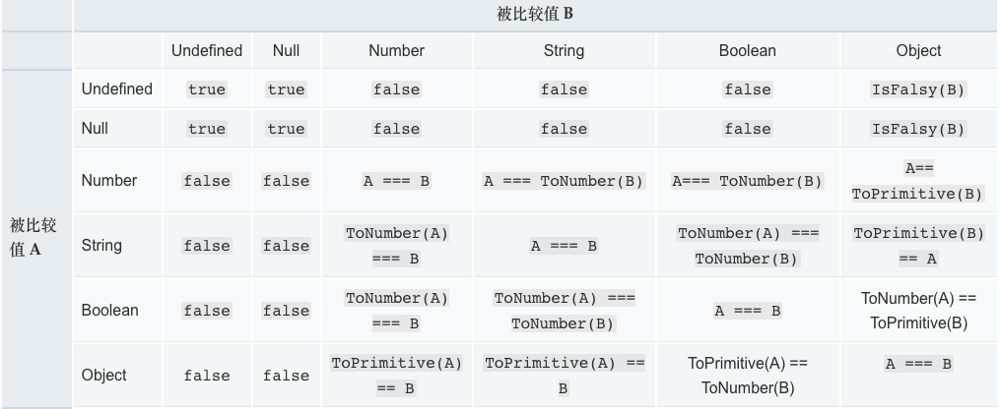
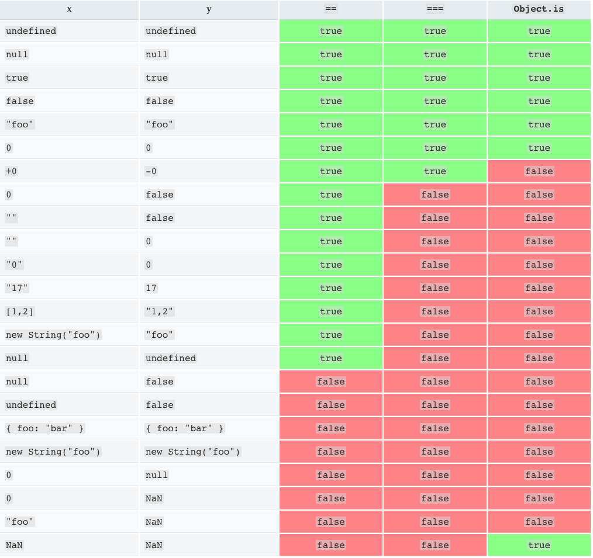

# 相等判断

[相等判断](https://developer.mozilla.org/zh-CN/docs/Web/JavaScript/Equality_comparisons_and_sameness)

## 介绍

JavaScript提供三种不同的值比较操作：

* 严格相等比较 (也被称作"strict equality", "identity", "triple equals")，使用 === ,
* 抽象相等比较 ("loose equality"，"double equals") ，使用 ==
* 以及 Object.is （ECMAScript 2015/ ES6 新特性）

简而言之，在比较两件事情时，双等号将执行类型转换; 三等号将进行相同的比较，而不进行类型转换 (如果类型不同, 只是总会返回 false );  而Object.is的行为方式与三等号相同，但是对于NaN和-0和+0进行特殊处理，所以最后两个不相同，而Object.is（NaN，NaN）将为 true。(通常使用双等号或三等号将NaN与NaN进行比较，结果为false，因为IEEE 754如是说.) 请注意，所有这些之间的区别都与其处理原语有关; 这三个运算符的原语中，没有一个会比较两个变量是否结构上概念类似。对于任意两个不同的非原始对象，即便他们有相同的结构， 以上三个运算符都会计算得到 false 。

## 严格相等`===`

全等操作符比较两个值是否相等，两个被比较的值在比较前都不进行隐式转换。如果两个被比较的值具有不同的类型，这两个值是不全等的。否则，如果两个被比较的值类型相同，值也相同，并且都不是 number 类型时，两个值全等。最后，如果两个值都是 number 类型，当两个都不是 NaN，并且数值相同，或是两个值分别为 +0 和 -0 时，两个值被认为是全等的。

* 全等操作符认为 +0 和 -0 是全等的
* 全等操作符认为 NaN 与其他任何值都不全等，包括它自己。（等式 (x !== x) 成立的唯一情况是 x 的值为 NaN）
  
## 非严格相等`==`

相等操作符比较两个值是否相等，在比较前将两个被比较的值转换为相同类型。在转换后（等式的一边或两边都可能被转换），最终的比较方式等同于全等操作符 === 的比较方式。 相等操作符满足交换律。

相等操作符对于不同类型的值，进行的比较如下图所示：

ToNumber(A) 尝试在比较前将参数 A 转换为数字，这与 +A（单目运算符+）的效果相同。ToPrimitive(A)通过尝试调用 A 的A.toString() 和 A.valueOf() 方法，将参数 A 转换为原始值（Primitive）。

`==`算法，一共有 12 步，翻译如下:

1. 如果x不是正常值（比如抛出一个错误），中断执行。
2. 如果y不是正常值，中断执行。
3. 如果Type(x)与Type(y)相同，执行严格相等运算x === y。
4. 如果x是null，y是undefined，返回true。
5. 如果x是undefined，y是null，返回true。
6. 如果Type(x)是数值，Type(y)是字符串，返回x == ToNumber(y)的结果。
7. 如果Type(x)是字符串，Type(y)是数值，返回ToNumber(x) == y的结果。
8. 如果Type(x)是布尔值，返回ToNumber(x) == y的结果。
9. 如果Type(y)是布尔值，返回x == ToNumber(y)的结果。
10. 如果Type(x)是字符串或数值或Symbol值，Type(y)是对象，返回x == ToPrimitive(y)的结果。
11. 如果Type(x)是对象，Type(y)是字符串或数值或Symbol值，返回ToPrimitive(x) == y的结果。
12. 返回false。

[`==`算法](https://es6.ruanyifeng.com/#docs/spec)

## Object.is

* Object.is认为 +0 和 -0 相等true
* Object.is认为 NaN 与 NaN 相等true

## 总结

